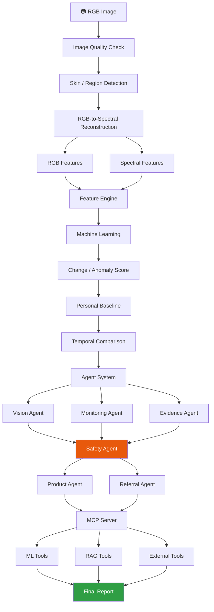
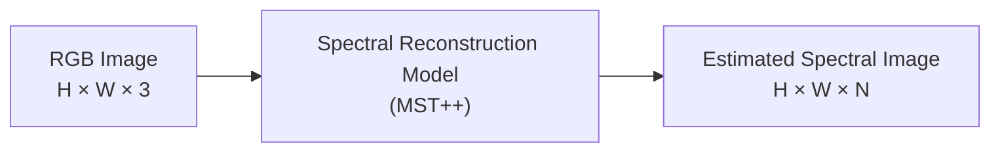
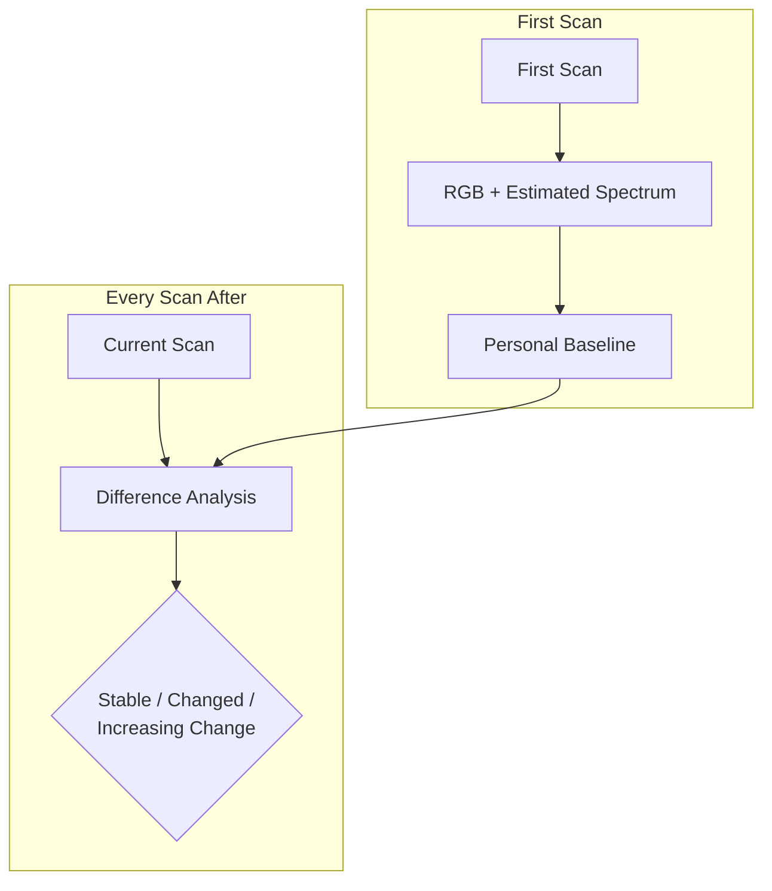
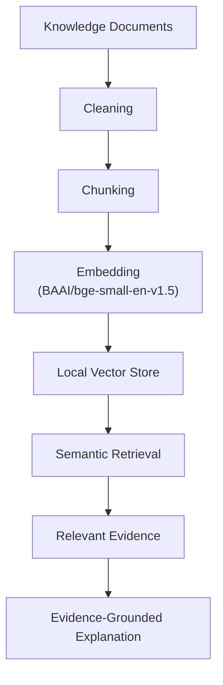
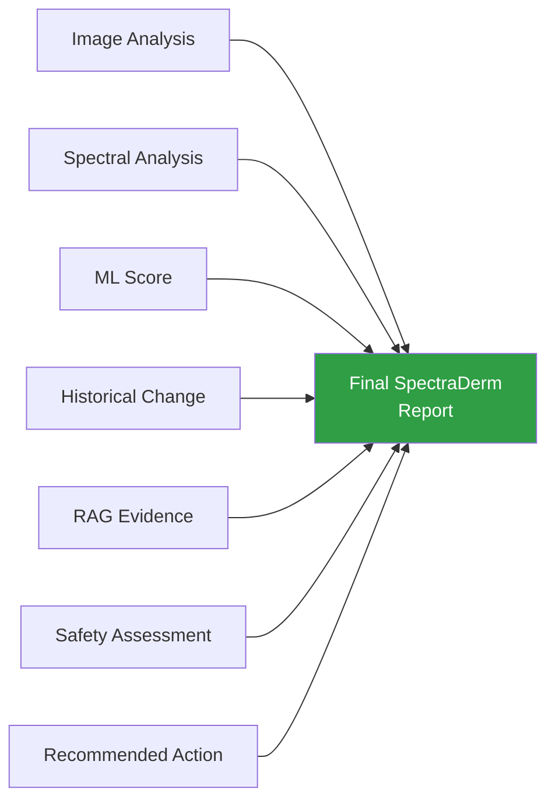
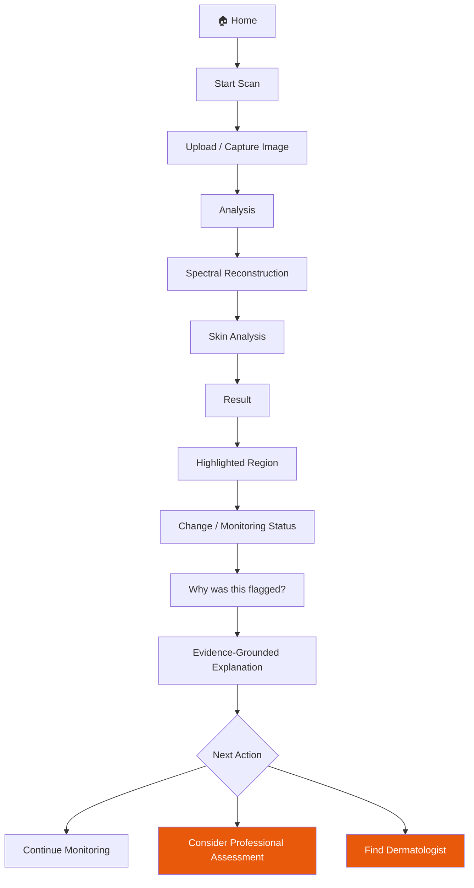

<a id="readme-top"></a>

<div align="center">

<!-- Optional: drop a logo at docs/assets/logo.png and uncomment this line -->
<!--  -->

# 🔬 SpectraDerm

**An AI-powered skin monitoring prototype that turns an ordinary phone photo into a longitudinal signal, no multispectral hardware required.**


<!-- Once this is pushed to GitHub, swap YOUR_USERNAME below for live, auto-updating badges -->
<!--


-->

</div>

<br/>

> [!IMPORTANT]
> SpectraDerm is a **monitoring and awareness** prototype. It does not diagnose skin disease, output a disease probability, or replace a dermatologist. Its spectral output is AI‑*estimated*, not a physical multispectral/hyperspectral measurement.

<br/>

## 🎥 Demo

<div align="center">

<video src="https://github.com/user-attachments/assets/361f7c7d-35b5-4c97-9c19-60450a9bd97a" controls width="100%"></video>

</div>

<p align="right"><a href="#readme-top">back to top ↑</a></p>


<!--
  HOW TO ADD YOUR DEMO VIDEO — pick one:

  OPTION 1 (recommended): Native, playable GitHub video
    1. Open any Issue or PR on this repo in your browser (you can close/delete it after).
    2. Drag-and-drop your demo .mp4 into the comment box.
    3. GitHub uploads it and gives you a link like:
       https://github.com/user-attachments/assets/xxxxxxxx-xxxx-xxxx-xxxx-xxxxxxxxxxxx
    4. Paste that link as the src below — it will play inline with controls on GitHub.

    <video src="https://github.com/user-attachments/assets/361f7c7d-35b5-4c97-9c19-60450a9bd97a" controls width="100%"></video>

  OPTION 2: YouTube (click-through thumbnail, works everywhere incl. npm/PyPI mirrors)

    <a href="https://youtube.com/watch?v=YOUR_VIDEO_ID">
      
    </a>

  OPTION 3: Looping GIF preview (silent, autoplays, largest file size)

    
-->


</div>

<p align="right"><a href="#readme-top">back to top ↑</a></p>

## 📖 Table of Contents

- [System Architecture](#-system-architecture)
- [Pipeline Overview](#-pipeline-overview)
- [Spectral Reconstruction](#-spectral-reconstruction)
- [Feature Engineering](#-feature-engineering)
- [Machine Learning and Change Detection](#-machine-learning-and-change-detection)
- [Personal Baseline and Longitudinal Monitoring](#-personal-baseline-and-longitudinal-monitoring)
- [RAG Pipeline](#-rag-pipeline)
- [Multi-Agent Architecture](#-multi-agent-architecture)
- [MCP Integration](#-mcp-integration)
- [Final Report](#-final-report)
- [Application Flow](#-application-flow)
- [Technology Stack](#-technology-stack)
- [Project Structure](#-project-structure)
- [Environment Variables](#-environment-variables)
- [Installation](#-installation)
- [Testing](#-testing)
- [Privacy and Safety](#-privacy-and-safety)
- [Limitations](#-limitations)
- [Project Goals](#-project-goals)
- [Team](#-team)
- [Disclaimer](#-disclaimer)
- [License](#-license)


**User journey:** `Home → Scan → Analysis → Result → History → Explanation → Next Action`

<p align="right"><a href="#readme-top">back to top ↑</a></p>

## 🏗️ System Architecture



<p align="right"><a href="#readme-top">back to top ↑</a></p>

## 🔄 Pipeline Overview

A higher-level view of the same journey, stage by stage:


<p align="right"><a href="#readme-top">back to top ↑</a></p>

## Spectral Reconstruction

SpectraDerm converts an ordinary RGB image into an **AI-estimated spectral representation**, used to derive additional features alongside conventional RGB features.



> [!NOTE]
> This is explicitly *AI-estimated* spectral information, not an actual multispectral/hyperspectral measurement.

<p align="right"><a href="#readme-top">back to top ↑</a></p>

## 🧬 Feature Engineering

| Category | Examples |
|---|---|
| **RGB Features** | Color statistics, texture, shape, local contrast, pigmentation-related features |
| **Spectral Features** | Band-wise intensity, spectral ratios, spectral differences, regional spectral statistics, spectral signatures |
| **Temporal Features** | Historical scan information used for longitudinal monitoring and comparison |

The combined feature representation feeds the downstream machine-learning pipeline.

<p align="right"><a href="#readme-top">back to top ↑</a></p>

## 🤖 Machine Learning and Change Detection

SpectraDerm compares an RGB-only baseline against an **RGB + estimated-spectral** representation to test whether the extra spectral signal helps.

The output is a **change/anomaly score**, not a disease probability:

```
Change / Anomaly Score: 72 / 100
```

This means the observed pattern differs from the relevant reference pattern — **it is not a 72% probability of disease.**

<p align="right"><a href="#readme-top">back to top ↑</a></p>

## 👤 Personal Baseline and Longitudinal Monitoring

Because everyone's skin differs, SpectraDerm builds a **personal** reference rather than comparing against a population average.



Trend visualization becomes more meaningful as more scans accumulate.

<p align="right"><a href="#readme-top">back to top ↑</a></p>

## 📚 RAG Pipeline

Used whenever the user asks **"Why was this flagged?"** — retrieves relevant dermatology evidence and grounds the explanation in it, rather than letting a model free-generate the answer.



The knowledge base covers general dermatology, skin pigmentation, melanin, common skin conditions, warning signs, and situations where professional assessment may help.

<p align="right"><a href="#readme-top">back to top ↑</a></p>

## 🧠 Multi-Agent Architecture

| Agent | Responsibility |
|---|---|
| **Vision Agent** | Interprets image, spectral, feature, and ML outputs |
| **Monitoring Agent** | Handles scan history, comparisons, and trends |
| **Evidence Agent** | Performs RAG retrieval and evidence-grounded explanations |
| **Safety Agent** | Performs safety checks and referral logic |
| **Product Agent** | Handles skincare / product-category guidance |
| **Referral Agent** | Surfaces dermatologist options |
| **Orchestrator Agent** | Coordinates the overall workflow |

Splitting responsibilities this way lets each agent be developed, tested, and improved independently.

<p align="right"><a href="#readme-top">back to top ↑</a></p>

## 🔌 MCP Integration

SpectraDerm uses **Model Context Protocol (MCP)** as the standardized tool layer between agents and core capabilities:

```python
reconstruct_spectrum()
analyze_skin()
extract_features()
calculate_warning_score()
compare_scans()
retrieve_evidence()
get_skin_history()
find_dermatologists()
get_partner_products()
generate_report()
```

<p align="right"><a href="#readme-top">back to top ↑</a></p>

## 📄 Final Report



The goal is a structured monitoring result — not just a number on a screen.

<p align="right"><a href="#readme-top">back to top ↑</a></p>

## 🖥️ Application Flow



<p align="right"><a href="#readme-top">back to top ↑</a></p>

## 🛠️ Technology Stack

**Frontend**


**Backend**


**Computer Vision & Deep Learning**


**Data & Scientific Computing**


**Machine Learning**


**RAG**


**Testing**


<details>
<summary><strong>Full dependency list</strong></summary>

- **Agents & tools:** custom Python agent architecture, official Python MCP SDK
- **Storage:** local filesystem-backed JSON metadata, managed image artifacts, local NumPy embedding storage
- **External integration:** HTTPX, Google Places–oriented dermatologist referral provider

</details>

<p align="right"><a href="#readme-top">back to top ↑</a></p>

## 📂 Project Structure

<details>
<summary><strong>Click to expand the directory tree</strong></summary>

```text
SpectraDerm/
│
├── frontend/
│   ├── src/
│   ├── public/
│   └── package.json
│
├── backend/
│   ├── agents/
│   ├── api/
│   ├── ml/
│   ├── rag/
│   ├── mcp/
│   ├── storage/
│   ├── reporting/
│   └── tests/
│
├── models/
│   └── spectral/
│
├── data/
│   └── knowledge/
│
├── notebooks/
├── tests/
│
├── .env.example
├── requirements.txt
└── README.md
```

*The exact structure may vary depending on the current implementation.*

</details>

<p align="right"><a href="#readme-top">back to top ↑</a></p>

## ⚙️ Environment Variables

Create a `.env` file based on the project's environment configuration, for example:

```env
GOOGLE_MAPS_API_KEY=your_google_maps_api_key
```

Additional variables may be required depending on which services and deployment environment you enable.

> [!WARNING]
> Never commit API keys or other secrets to Git.

<p align="right"><a href="#readme-top">back to top ↑</a></p>

## 🚀 Installation

<details open>
<summary><strong>1. Clone the repository</strong></summary>

```bash
git clone <repository-url>
cd SpectraDerm
```

</details>

<details open>
<summary><strong>2. Create a Python virtual environment</strong></summary>

```bash
python -m venv .venv
```

Activate it:

| OS | Command |
|---|---|
| Windows | `.venv\Scripts\activate` |
| Linux / macOS | `source .venv/bin/activate` |

</details>

<details open>
<summary><strong>3. Install backend dependencies</strong></summary>

```bash
pip install -r requirements.txt
```

</details>

<details open>
<summary><strong>4. Install frontend dependencies</strong></summary>

```bash
cd frontend
npm install
cd ..
```

</details>

<details open>
<summary><strong>5. Configure environment variables</strong></summary>

Create the `.env` file described above.

</details>

<details open>
<summary><strong>6. Start the backend</strong></summary>

```bash
uvicorn backend.main:app --reload
```

</details>

<details open>
<summary><strong>7. Start the frontend</strong></summary>

```bash
cd frontend
npm run dev
```

The frontend will then be available through the Vite development server.

</details>

<p align="right"><a href="#readme-top">back to top ↑</a></p>

## 🧪 Testing

```bash
# Backend
pytest

# Frontend
npm test
```

Coverage spans image processing, ML functionality, RAG retrieval, agent behavior, safety logic, MCP tools, referral workflow, frontend components, and end-to-end integration.

<p align="right"><a href="#readme-top">back to top ↑</a></p>

## 🔐 Privacy and Safety

Because SpectraDerm processes skin images, privacy and responsible-use design are core, not an afterthought:

- Pseudonymous user IDs
- Minimum-necessary information
- Access controls
- Secure storage
- Consent handling
- Data deletion
- Safety checks before recommendations or referrals

> [!NOTE]
> SpectraDerm is **HIPAA-aware / HIPAA-inspired**, but does **not** claim legal HIPAA compliance. Actual compliance depends on the organization, deployment environment, data flows, and applicable jurisdiction.

<p align="right"><a href="#readme-top">back to top ↑</a></p>

## ⚠️ Limitations

1. **Estimated spectral information** — the reconstructed spectrum is a model prediction, not a physical measurement.
2. **Not a diagnostic system** — SpectraDerm does not diagnose skin diseases.
3. **Change score ≠ disease probability** — a high score means deviation from a reference pattern, nothing more.
4. **Medical significance isn't guaranteed** — a detected change may or may not be medically significant.
5. **Prototype status** — this is a capstone prototype, not a clinically validated medical device.
6. **Professional assessment matters** — concerning or persistent changes may warrant a dermatologist, not just this tool.

<p align="right"><a href="#readme-top">back to top ↑</a></p>

## 🎯 Project Goals

SpectraDerm combines computer vision, spectral AI, feature engineering, machine learning, longitudinal monitoring, RAG, multi-agent AI, MCP, FastAPI, and React into one end-to-end workflow — exploring how far accessible smartphone imagery and modern AI can go for **skin monitoring and awareness**, without specialized imaging hardware, while clearly separating model-derived observations from medical diagnosis.

<p align="right"><a href="#readme-top">back to top ↑</a></p>

## 👥 Team

**SpectraDerm — AI/ML Capstone Project**

| Name | Focus |
|---|---|
| **Zainab Fatima** | Data, Computer Vision & Spectral AI |
| **Ayesha Noor** | Machine Learning, RAG & AI Agents |
| **Javaria Akbar** | Backend, Frontend, Privacy & Testing |

<p align="right"><a href="#readme-top">back to top ↑</a></p>

## 📌 Disclaimer

> [!WARNING]
> SpectraDerm is an educational AI/ML capstone prototype for skin monitoring and awareness. It is **not medical advice, a medical diagnosis system, or a replacement for professional dermatological assessment.**
>
> If a skin change is persistent, concerning, rapidly changing, painful, bleeding, or otherwise worrying, seek appropriate professional medical advice.

<p align="right"><a href="#readme-top">back to top ↑</a></p>

## 📜 License

This project is currently intended for educational and research purposes. A project-specific license can be added here once finalized.

<div align="center">

---

Built as a collaborative end-to-end AI/ML capstone.

<a href="#readme-top">⬆ back to top</a>

</div>
